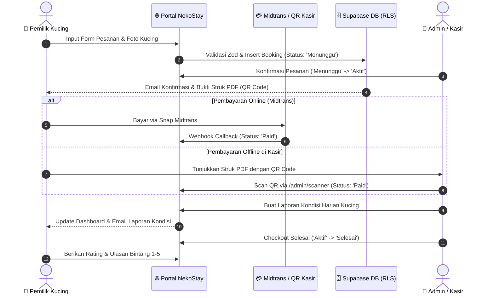

# 🐱 NekoStay — Premium Open Source Cat Boarding & Hotel Platform

[-orange?style=flat-square&logo=nextdotjs)](https://nextjs.org)
[](https://react.dev)
[-emerald?style=flat-square&logo=supabase)](https://supabase.com)
[](https://github.com/WhiskeySockets/Baileys)
[](scripts/test-suite.mjs)
[-blueviolet?style=flat-square)](docs/SECURITY-AUDIT.md)
[](https://tailwindcss.com)
[](LICENSE)

**NekoStay** adalah platform web open-source modern untuk pengelolaan bisnis penitipan dan hotel kucing (cat boarding & care). NekoStay dirancang untuk memudahkan pemilik kucing melakukan pemesanan secara online serta membantu pemilik bisnis pet hotel mengelola operasional, laporan kesehatan harian kucing, pembayaran ganda (online & kasir), bot WhatsApp otomatis, dan analitik pendapatan.

---

## 🌟 Fitur Utama (Key Features)

### 👤 Portal Pelanggan (Cat Owner Portal)
* **Autentikasi Aman & Captcha Turnstile**: Proteksi bot terverifikasi via Cloudflare Turnstile Captcha pada form Login, Registrasi, dan Reset Password dengan validasi proaktif sisi klien.
* **Sistem Notifikasi Error Ramah Pengguna (User-Centric & Anti-Slop)**: Seluruh kegagalan (captcha, kredensial, koneksi, kuota kamar) disajikan dalam bahasa empati dengan tips solusi jelas (`UserErrorAlert`). Tidak ada kebocoran teknis database/SQL di mode produksi (OWASP A04/A05).
* **Formulir Pemesanan Cerdas (3 Langkah)**: Input data kucing (nama, umur, ras, makanan favorit, riwayat kesehatan, kehamilan, catatan khusus), validasi format MIME gambar client-side, upload foto ke Supabase Storage, dan pilih paket kamar (`Basic`, `Standard`, `Premium`).
* **Sistem Pembayaran Fleksibel**:
  - **Online**: Integrasi Snap Midtrans (Virtual Account, GoPay, QRIS, Kartu Kredit).
  - **Kasir (Offline)**: Pop-up modal QR Code interaktif berskala responsif (25% - 100%+ zoom), unduh bukti pemesanan PDF resmi, dan token bayar di kasir dengan masa berlaku 24 jam.
* **Manajemen Kapasitas Kamar & Antrian Cerdas**:
  - Pengecekan ketersediaan kamar dan perkiraan hari terdekat (`earliestCheckoutDate`).
  - **Toleransi Antrian Maksimal 3 Hari**: Jika kamar penuh dan perkiraan ketersediaan terdekat `≤ 3 hari`, pengguna dapat masuk antrian (*Waitlist*).
  - **Penolakan Otomatis (> 3 Hari)**: Jika perkiraan kamar kosong melebihi 3 hari, sistem otomatis menolak pemesanan dengan template penolakan resmi karena kamar penuh.
* **Laporan Kondisi Kucing Realtime**: Memantau laporan perkembangan harian kucing (foto terbaru, nafsu makan, status kesehatan: Sehat / Kurang Fit / Perlu Perhatian) dari dashboard dan notifikasi email tersanitasi anti-XSS.
* **Program Loyalitas & Referral**: Dapatkan kode referral unik (`NEKO-XXXXXXXX`) saat mendaftar. Bagikan ke teman untuk mendapatkan diskon 10% dan kumpulkan Poin Neko.
* **Ulasan & Rating**: Berikan penilaian bintang 1-5 dan ulasan setelah pesanan selesai, serta lihat balasan resmi dari admin.
* **Fitur Kenyamanan**: Dark & Light mode switch, multi-bahasa instan (Bahasa Indonesia & English), animasi interaktif GSAP, dan optimasi Core Web Vitals (Next.js Image LCP priority).

### 👑 Panel Manajemen Admin (Admin Control Center)
* **Executive Analytics Dashboard & Chart Adaptif**:
  - Grafik pendapatan bulanan, occupancy rate kamar, dan metrik pesanan secara real-time via Recharts dengan kalkulasi single-pass O(n).
  - **Chart Donut Kelas Kamar Adaptif & Kustomisasi Warna**: Mendukung penambahan kelas kamar baru secara dinamis dengan palet 16 warna harmonis dan modal pemilih warna per kelas (`ClassColorCustomizerModal`).
* **Manajemen Kamar & Kandang**: Kartu kelas kamar ringkas dengan modal edit terintegrasi, pemantauan kapasitas terisi real-time, dan pengaturan kandang isolasi/maintenance.
* **Manajemen Pesanan & Tindakan Massal**: Filter pesanan berdasarkan status, kelas kamar, bulan, dan tahun. Konfirmasi, tolak dengan template alasan cepat, atau lakukan persetujuan massal (*bulk actions*).
* **Perubahan Status Pembayaran Darurat Terverifikasi**: Modal khusus (`EmergencyPaymentModal`) untuk perubahan status pembayaran darurat dengan validasi alasan audit wajib (min 5 karakter) dan konfirmasi tanggung jawab.
* **Evaluasi Otomatis Antrian Penuh**: Tombol 1-klik `Cek Antrian Penuh (>3 Hari)` dan background cron `GET /api/cron/check-waiting` untuk membersihkan dan menolak antrian yang melebihi batas 3 hari.
* **QR Camera Scanner Kasir (`/admin/scanner`)**: Pemindaian kamera langsung untuk memvalidasi pembayaran tunai di kasir secara instan dan aman (*one-time use*).
* **Pembuat Laporan Kucing Harian (`/admin/reports`)**: Input laporan kondisi fisik & mental kucing dengan upload foto yang langsung terkirim ke email pelanggan.
* **WhatsApp Multi-Device Gateway & Direct Chat (`/admin/whatsapp`)**:
  - Koneksi resmi `@whiskeysockets/baileys` Multi-Device tanpa biaya langganan API.
  - Scan QR pairing, riwayat log percakapan live, dan auto-responder cerdas 24/7.
  - **Fitur Chat Langsung Admin**: Pelanggan dapat memilih opsi 3 (Chat dengan Admin) untuk menjeda bot, dan bot otomatis aktif kembali setelah 1 jam inaktivitas atau saat pelanggan mengetik kata kunci *MENU*.
* **Ekspor Laporan PDF Premium**: Unduh rekapitulasi data transaksi dan laporan keuangan dalam format PDF Landscape A4 resmi (termasuk perbaikan bug decode saat dibuka dari aplikasi Gmail seluler).

---

## 🛠️ Tech Stack & Architecture

| Layer / Kategori | Teknologi | Deskripsi |
|---|---|---|
| **Frontend & Framework** | Next.js 16.2.6 (App Router) & React 19.2.4 | Server Components, dynamic async routing, Turbopack builder, Core Web Vitals Next/Image |
| **Database & Auth** | Supabase (PostgreSQL 15+) & Turnstile | Row Level Security (RLS), Auth SSR, Cloudflare Turnstile Captcha bot protection |
| **Styling & UI** | Tailwind CSS v4, shadcn/ui, Lucide Icons | Glassmorphism UI, Dark Mode, mobile bottom navigation, tree-shaking optimizePackageImports |
| **Animasi** | GSAP, Anime.js, Lenis | Magnetic CTA, looping marquee, 3D card tilt, elastic smooth scroll |
| **Payment Gateway** | Midtrans Client & Offline QR Scanner | Pembayaran online Snap API, timeout protection & verifikasi webhook SHA512 |
| **WhatsApp Gateway** | `@whiskeysockets/baileys` Multi-Device | Koneksi socket WhatsApp, auto-responder, chat langsung admin 1h timeout |
| **Email & Struk** | Resend / EmailJS + jsPDF & jsPDF-Autotable | Pengiriman email transaksional tersanitasi XSS & render struk PDF otomatis |
| **Validasi & State** | Zod 3 + React Hook Form + Zustand 5 | Validasi runtime ketat, client MIME allowlist & global store multi-language |
| **Keamanan & Rate Limit** | In-Memory Sliding Window + CSP Headers | Anti-clickjacking CSP frame-ancestors, open redirect guard, dan pembatasan 30 req/menit |
| **Testing Suite** | Node.js Test Runner (`scripts/test-suite.mjs`) | Pengujian otomatis 76 skenario logika bisnis, matematika denda, Zod, dan bot lifecycle |

---

## 🚀 Panduan Lengkap Instalasi & Menjalankan (Step-by-Step Guide)

Ikuti langkah-langkah berikut untuk menjalankan proyek NekoStay di komputer lokal Anda:

### 1. Prasyarat Sistem (Prerequisites)
Pastikan Anda telah menginstal perangkat lunak berikut:
- **Node.js**: Versi `18.x` atau lebih baru ([Unduh Node.js](https://nodejs.org/))
- **Git**: Versi terbaru ([Unduh Git](https://git-scm.com/))
- Akun **Supabase** gratis ([supabase.com](https://supabase.com))
- Akun **Midtrans** (Sandbox/Production) ([midtrans.com](https://midtrans.com))
- Akun **Resend** untuk pengiriman email ([resend.com](https://resend.com)) *(Opsional)*

---

### 2. Kloning Repositori
Buka terminal dan jalankan:
```bash
git clone https://github.com/2Hafast8/NekoStay.git
cd NekoStay
```

---

### 3. Instalasi Dependensi
Instal seluruh paket dependensi yang dibutuhkan:
```bash
npm install
```

---

### 4. Setup Database Supabase
1. Buat project baru di [Supabase Dashboard](https://supabase.com/dashboard).
2. Buka menu **SQL Editor** pada project Supabase Anda.
3. Buka file [`supabase/schema.sql`](./supabase/schema.sql), salin seluruh isinya, dan tempelkan ke SQL Editor Supabase, lalu klik tombol **Run**.
   > Skrip ini akan membuat tabel (`profiles`, `classes`, `bookings`, `cat_reports`, `notifications`, `reviews`, `promos`, `whatsapp_bot_state`, `whatsapp_logs`), fungsi trigger otomatis, seed data kelas kamar, dan kebijakan Row Level Security (RLS).
4. Buka menu **Storage** → klik **New Bucket**:
   - Beri nama: `cat-photos`
   - Aktifkan opsi **Public bucket** (agar foto kucing dapat ditampilkan di aplikasi) → klik **Save**.

---

### 5. Konfigurasi Environment Variables
Buat file baru bernama `.env.local` atau `.env` di folder utama proyek (root), lalu salin konfigurasi berikut dan sesuaikan nilainya:

```env
# ============================================================
# SUPABASE CONFIGURATION
# ============================================================
NEXT_PUBLIC_SUPABASE_URL=https://your-project-id.supabase.co
NEXT_PUBLIC_SUPABASE_ANON_KEY=eyJhbGciOiJIUzI1NiIsInR5cCI6IkpXVCJ9...
SUPABASE_SERVICE_ROLE_KEY=eyJhbGciOiJIUzI1NiIsInR5cCI6IkpXVCJ9...

# ============================================================
# APP CONFIGURATION
# ============================================================
NEXT_PUBLIC_APP_URL=http://localhost:3000
NEXT_PUBLIC_ADMIN_WHATSAPP=6282371986344

# ============================================================
# EMAIL ENGINE (Dual-Mode: Resend / EmailJS)
# ============================================================
EMAIL_PROVIDER=resend
RESEND_API_KEY=re_your_api_key_here
RESEND_FROM_EMAIL=onboarding@resend.dev

# ============================================================
# MIDTRANS PAYMENT GATEWAY
# ============================================================
# Set ke "false" untuk Sandbox, "true" untuk Production
MIDTRANS_IS_PRODUCTION=false
NEXT_PUBLIC_MIDTRANS_IS_PRODUCTION=false
MIDTRANS_SERVER_KEY=SB-Mid-server-your-server-key
NEXT_PUBLIC_MIDTRANS_CLIENT_KEY=SB-Mid-client-your-client-key

# ============================================================
# CRON SECURITY SECRET
# ============================================================
CRON_SECRET=random-super-secret-string-12345
```

---

### 6. Menjalankan Pengujian Otomatis (Automated Tests)
Verifikasi logika bisnis, kalkulasi harga, denda keterlambatan 8%, skema validasi Zod, resolusi JID/LID WhatsApp, chatbot echo protection, dan sanitasi error:
```bash
npm test
```
*Output yang diharapkan: `📊 HASIL PENGUJIAN OTOMATIS: 141 / 141 BERHASIL (100% PASS)`.*

---

### 7. Menjalankan Server Pengembangan (Development Server)
Jalankan aplikasi di mode lokal:
```bash
npm run dev
```
Buka browser dan akses **[http://localhost:3000](http://localhost:3000)**.

---

### 8. (Opsional) Menjalankan WhatsApp Bot Engine
Untuk mengaktifkan integrasi WhatsApp gateway `@whiskeysockets/baileys` Multi-Device:
```bash
# Menjalankan service WhatsApp bot
npm run wa:bot

# Atau menjalankan pairing code langsung di terminal
npm run wa:bot:pair
```
Buka menu `/admin/whatsapp` di web untuk melihat QR code pairing, status koneksi live, log pesan, dan status sesi chat langsung admin.

---

### 9. Membuat Akun Admin
Secara default, pengguna baru yang mendaftar akan memiliki role `user`. Untuk mengubah akun Anda menjadi `admin`:
1. Daftar akun melalui halaman `/register`.
2. Buka Supabase Dashboard → **SQL Editor**, lalu jalankan query:
   ```sql
   UPDATE public.profiles
   SET role = 'admin'
   WHERE email = 'email-anda@example.com';
   ```
3. Logout dan login kembali. Anda sekarang dapat mengakses dashboard admin di `/admin/dashboard` dan `/admin/scanner`.

---

## 🧪 Skenario Alur Kerja Bisnis (Core Business Workflow)



---

### 📁 Struktur Direktori Proyek
 
```
NekoStay/
├── app/                  # Next.js App Router (47 Routes Prerendered)
│   ├── (auth)/           # Halaman Login, Register, Forgot Password (Turnstile Captcha)
│   ├── (user)/           # Dashboard user, booking, profil, notifikasi
│   ├── (admin)/          # Dashboard admin, scanner QR, laporan, reviews, whatsapp
│   └── api/              # REST API Route Handlers (hardened with Zod, RBAC, Rate-Limit)
├── components/           # Komponen React (UI, Form, Dialogs, Charts, Badges)
│   ├── admin/            # EmergencyPaymentModal, ClassColorCustomizerModal, dsb.
│   ├── shared/           # UserErrorAlert, SupabaseCaptcha, ConfirmDialog, GsapDataLoader
│   └── booking/          # BookingForm, BookingStatus, PriceCalculator, OfflineQrModal
├── docs/                 # Dokumentasi Lengkap (C4, API Spec, Security Audit, Walkthrough)
│   ├── 00-INDEX.md       # Indeks dokumentasi utama
│   ├── C4-ARCHITECTURE.md# Arsitektur sistem C4 Code-level
│   ├── API-SPECIFICATION.md # Spesifikasi REST API Endpoints
│   ├── SECURITY-AUDIT.md # Laporan audit keamanan OWASP Top 10 & Hardening
│   └── SYSTEM_WALKTHROUGH.md # Panduan komprehensif alur sistem
├── hooks/                # Custom React & Zustand Hooks (zero cascading renders)
├── lib/                  # Library domain & utilitas
│   ├── modules/          # Domain Services bergaya NestJS (Separation of Concerns)
│   │   ├── pricing/      # pricing.service.js, capacity.service.js, index.js
│   │   └── whatsapp/     # baileys.service.js, bot.service.js, jid.service.js, index.js
│   ├── constants/        # Enums, rates, color palettes, dan JSDoc typedefs
│   ├── supabase/         # Client browser, server, dan admin helpers
│   ├── utils/            # errors.js, response.js, dates.js, rate-limit.js, format.js
│   └── validations/      # Zod validation schemas
├── public/               # File statis, logo, branding, dan aset gambar
├── scripts/              # Automated Test Runner & WhatsApp Bot script
│   ├── test-suite.mjs    # Node.js automated test runner (141 skenario uji)
│   └── whatsapp-bot.mjs  # @whiskeysockets/baileys WhatsApp gateway worker
├── supabase/             # Skema SQL, triggers, RLS, dan migrasi database
│   └── schema.sql        # Skema lengkap Supabase PostgreSQL
├── package.json          # Manifest dependensi dan npm scripts
└── README.md             # Panduan proyek dan instalasi
```

---

## 🛡️ Keamanan & Kepatuhan Data

Proyek ini dibangun dengan standar keamanan modern:
* **Row Level Security (RLS)** pada seluruh tabel database untuk menjamin isolasi data pengguna.
* **Role-Based Access Control (RBAC)** dengan guard [`verifyAdmin()`](./lib/supabase/admin.js) dan [`verifyBookingAccess()`](./lib/supabase/admin.js).
* **Anti-Bot & Brute-Force Defense**: Cloudflare Turnstile Captcha diintegrasikan pada seluruh formulir autentikasi.
* **Rate Limiting Sisi Server**: In-memory sliding window rate limiter (30 req/menit) pada endpoint publik verifikasi kupon & referral (`lib/utils/rate-limit.js`).
* **Verifikasi SHA512 Signature** pada seluruh notifikasi webhook Midtrans dan timeout outbound API 10 detik (`AbortSignal.timeout`).
* **Perlindungan Open Redirect**: Sanitasi path redirection pada auth callback Supabase (`sanitizeRedirectPath`).
* **Validasi Tipe Konten File (MIME)**: Pengecekan ketat format gambar kucing client-side (`image/jpeg`, `image/png`, `image/webp`).
* **Sanitasi Entitas HTML Email**: Context-aware HTML entity encoding (`escapeHtml`) di seluruh template email transaksional untuk mencegah injeksi XSS.
* **Header Keamanan Browser**: Content-Security-Policy `frame-ancestors 'none'`, HSTS, X-Frame-Options `DENY`, Referrer-Policy `strict-origin-when-cross-origin`, dan X-Content-Type-Options `nosniff`.

---

## 🤝 Kontribusi & Lisensi

Proyek ini bersifat **Open Source** di bawah lisensi [MIT License](LICENSE). Kontribusi berupa Pull Requests, pelaporan bug, dan saran fitur baru sangat disambut!

1. Fork repositori ini.
2. Buat branch fitur baru (`git checkout -b feature/FiturKeren`).
3. Commit perubahan Anda (`git commit -m 'Menambahkan Fitur Keren'`).
4. Push ke branch Anda (`git push origin feature/FiturKeren`).
5. Buat Pull Request di GitHub.

---

## 👨‍💻 Author & Maintainer

* **Author**: [Hafast2008]
* **GitHub**: [@2Hafast8](https://github.com/2Hafast8)
* **Dokumentasi Lengkap**: Kunjungi folder [`docs/`](./docs/00-INDEX.md) untuk mempelajari spesifikasi arsitektur dan API secara mendalam.
