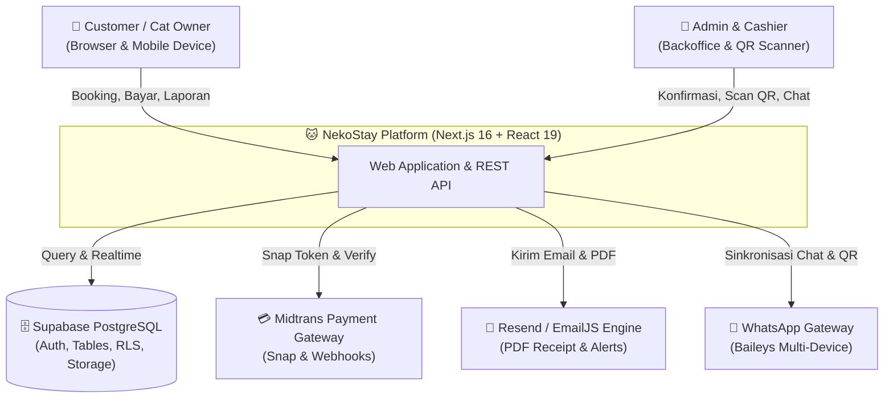
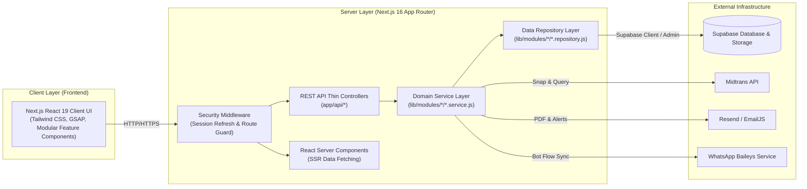
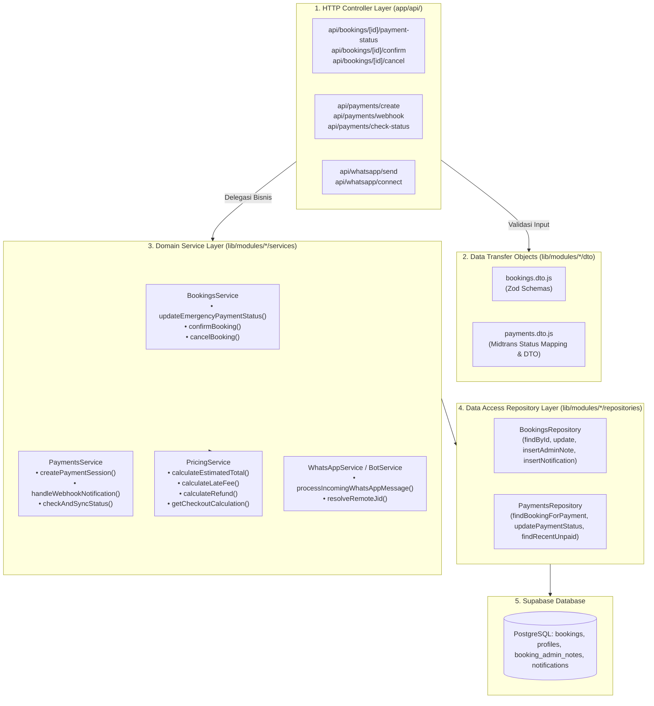

# NekoStay — C4 Architecture & Code-Level Specification

> Dokumen spesifikasi arsitektur tingkat rendah C4 (System Context, Container, Component, & Code Level) untuk platform **NekoStay**.
> Mengadopsi pola modular domain-driven terinspirasi dari **NestJS** (*Controller – Service – Repository*), DTO dengan validasi Zod ketat, dan dekomposisi komponen monolitik.
> Dibuat berdasarkan skill `c4-code`, `code-documentation-doc-generate`, `nestjs-patterns`, dan `code-documentation-code-explain`.

---

## 🏗️ 1. Level 1: System Context Diagram

Platform NekoStay melayani dua tipe pengguna utama (Customer dan Admin), terhubung ke gateway pembayaran Midtrans, database Supabase PostgreSQL, WhatsApp Multi-Device Gateway, dan Email Delivery Engine (Resend/EmailJS).

---

## 📦 2. Level 2: Container Diagram

---

## 🧩 3. Level 3: Component Diagram (Modular Domain Architecture)

Arsitektur backend NekoStay memisahkan tanggung jawab menjadi 3 lapis bersih (*Clean Architecture* terinspirasi dari NestJS):

---

## 🔬 4. Level 4: Code Level Signatures & Logic Contracts

### A. Modul Bookings (`lib/modules/bookings/`)
* **`BookingsService.updateEmergencyPaymentStatus(supabase, { bookingId, adminUser, paymentStatus, reason })`**: Mengubah status pembayaran secara darurat dengan validasi ketat, logging audit otomatis ke `booking_admin_notes`, dan pengiriman notifikasi pengguna.
* **`BookingsService.confirmBooking(supabase, { bookingId })`**: Mengonfirmasi pesanan dari status Menunggu/Antrian ke Aktif dan mengirimkan email konfirmasi.
* **`BookingsService.cancelBooking(supabase, { bookingId, userId, reason })`**: Membatalkan pesanan mandiri oleh pengguna secara atomik (hanya untuk status Menunggu).
* **`BookingsRepository`**: Mengenkapsulasi query Supabase untuk tabel `bookings`, `booking_admin_notes`, dan `notifications`.

### B. Modul Payments (`lib/modules/payments/`)
* **`PaymentsService.createPaymentSession({ supabase, user, bookingId, requestOrigin })`**: Menghasilkan token Snap Midtrans dan menyimpan referensi pesanan.
* **`PaymentsService.handleWebhookNotification(body)`**: Memverifikasi signature SHA-512 Midtrans, mencari pesanan (termasuk fallback pencocokan nominal untuk E-Wallet DANA), memperbarui status pembayaran, dan mengirim notifikasi.
* **`PaymentsService.checkAndSyncStatus({ bookingId, orderId })`**: Memverifikasi status transaksi langsung ke REST API Midtrans `/v2/{orderId}/status` dan melakukan sinkronisasi database.
* **`MidtransClient`**: Helper konfigurasi SDK Snap, SHA-512 signature hashing, dan direct REST client.

### C. Modul Pricing (`lib/modules/pricing/`)
* **`calculateEstimatedTotal(pricePerDay, checkIn, checkOut): number`**: Menghitung estimasi total dasar menginap.
* **`calculateLateFee(pricePerDay, scheduledCheckout, actualCheckout): { totalFee: number, breakdown: Array<{ day: number, fee: number }> }`**: Menghitung akumulasi denda harian dengan rasio majemuk `1.08^n`.
* **`calculateRefund(pricePerDay, scheduledCheckout, actualCheckout, checkIn, refundPercentage = 90): number`**: Menghitung refund pengambilan lebih awal sebesar 90% dari tarif harian sisa.
* **`getCheckoutCalculation(booking, actualCheckoutDate, refundPercentage = 90): CheckoutSummary`**: Helper komprehensif penentuan denda/refund saat checkout kasir.
* **`calculateCapacityAndWaitlist(totalCapacity, currentBooked, targetDays): { available: boolean, canWaitlist: boolean, rejectReason: string | null }`**: Menentukan toleransi antrian kamar (maksimal 3 hari).

### D. Modul WhatsApp (`lib/modules/whatsapp/`)
* **`resolveRemoteJid(target, metadata): string`**: Resolusi nomor telepon normal (08xx / 62xx) atau Linked Identity (LID) WhatsApp 14-16 digit menjadi format JID resmi.
* **`processIncomingWhatsAppMessage(remoteJid, messageText, pushName, isSelf): Promise<string | null>`**: Otomasi Finite State Machine WhatsApp Bot untuk alur pemesanan, ubah jadwal, dan handover mode live admin chat.

### E. Standardized Response Engine (`lib/utils/response.js`)
* **`apiSuccess(data, message, status, headers): NextResponse`**
* **`apiError(message, status, details): NextResponse`**
* **`apiUnauthorized(message): NextResponse`**
* **`apiForbidden(message): NextResponse`**
* **`apiNotFound(message): NextResponse`**
* **`apiBadRequest(message, details): NextResponse`**
* **`apiValidationError(zodError): NextResponse`**
