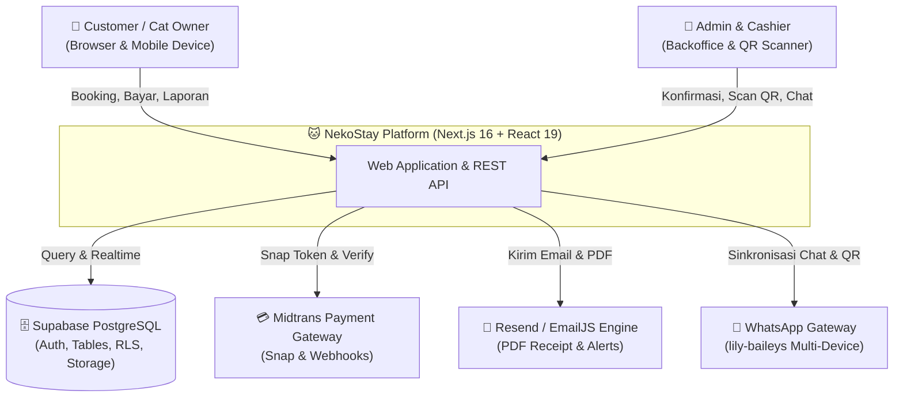
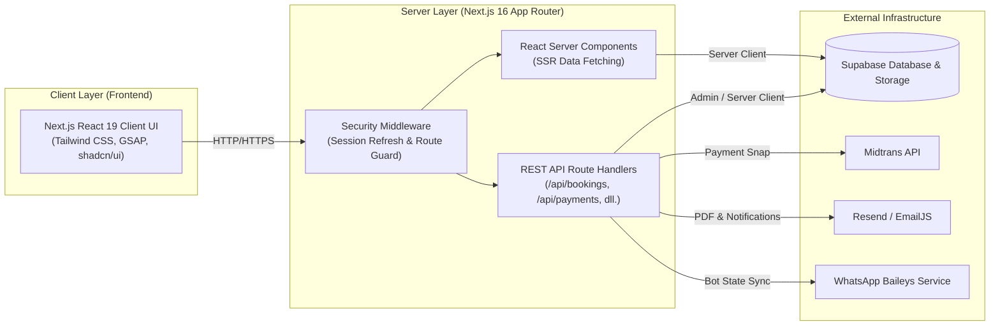

# NekoStay — C4 Architecture & Code-Level Specification

> Dokumen spesifikasi arsitektur tingkat rendah C4 (System Context, Container, Component, & Code Level) untuk platform **NekoStay**.
> Dibuat berdasarkan skill `c4-code`, `code-documentation-doc-generate`, dan `code-documentation-code-explain`.

---

## 🏗️ 1. Level 1: System Context Diagram

Platform NekoStay melayani dua tipe pengguna utama (Customer dan Admin), terhubung ke gateway pembayaran Midtrans, database Supabase PostgreSQL, WhatsApp Multi-Device Gateway, dan Email Delivery Engine (Resend/EmailJS).

---

## 📦 2. Level 2: Container Diagram

---

## 🧩 3. Level 3: Component Diagram (Backend API & Logic)

```mermaid
flowchart TD
    subgraph APIControllers ["API Controllers (app/api/)"]
        BookingsCtrl["bookings/route.js\n[POST]"]
        ConfirmCtrl["bookings/[id]/confirm/route.js\n[POST]"]
        CancelCtrl["bookings/[id]/cancel/route.js\n[POST]"]
        ReportCtrl["bookings/[id]/report/route.js\n[POST]"]
        ScanOfflineCtrl["payments/scan-offline/route.js\n[POST]"]
        MidtransWebhookCtrl["payments/webhook/route.js\n[POST]"]
        ReviewsCtrl["reviews/route.js\n[GET, POST]"]
        CronCtrl["cron/check-late/route.js\n[GET]"]
    end

    subgraph SharedModules ["Shared Logic & Helpers (lib/)"]
        AuthGuards["lib/supabase/admin.js\nverifyAdmin(), verifyBookingAccess()"]
        ValidationZod["lib/validations/booking.js\nZod Schemas"]
        PricingEngine["lib/utils/pricing.js\ncalculateLateFee(), calculateRefund()"]
        DateHelpers["lib/utils/dates.js\ndaysBetween(), isLate()"]
        ResponseHelper["lib/utils/response.js\napiSuccess(), apiError()"]
        EmailEngine["lib/email/resend.js\nsendBookingStatusUpdate(), generatePDFBuffer()"]
    end

    BookingsCtrl --> ValidationZod
    BookingsCtrl --> ResponseHelper
    ConfirmCtrl --> AuthGuards
    ConfirmCtrl --> EmailEngine
    CancelCtrl --> ValidationZod
    ReportCtrl --> AuthGuards
    ReportCtrl --> EmailEngine
    ScanOfflineCtrl --> AuthGuards
    ScanOfflineCtrl --> ValidationZod
    MidtransWebhookCtrl --> ResponseHelper
    CronCtrl --> PricingEngine
    CronCtrl --> EmailEngine
```

---

## 🔬 4. Level 4: Code Level Signatures & Logic Contracts

### A. Pricing Engine (`lib/utils/pricing.js`)
* **`calculateEstimatedTotal(pricePerDay, checkIn, checkOut): number`**: Menghitung estimasi total dasar menginap.
* **`calculateLateFee(pricePerDay, scheduledCheckout, actualCheckout): { totalFee: number, breakdown: Array<{ day: number, fee: number }> }`**: Menghitung akumulasi denda harian dengan rasio majemuk `1.08^n`.
* **`calculateRefund(pricePerDay, scheduledCheckout, actualCheckout, checkIn, refundPercentage = 90): number`**: Menghitung refund pengambilan lebih awal sebesar 90% dari tarif harian sisa.
* **`getCheckoutCalculation(booking, actualCheckoutDate, refundPercentage = 90): CheckoutSummary`**: Helper komprehensif penentuan denda/refund saat checkout kasir.

### B. Standardized Response Engine (`lib/utils/response.js`)
* **`apiSuccess(data, message, status, headers): NextResponse`**
* **`apiError(message, status, details): NextResponse`**
* **`apiUnauthorized(message): NextResponse`**
* **`apiForbidden(message): NextResponse`**
* **`apiNotFound(message): NextResponse`**
* **`apiBadRequest(message, details): NextResponse`**
* **`apiValidationError(zodError): NextResponse`**

### C. Security & Authorization Guards (`lib/supabase/admin.js`)
* **`createAdminClient(): SupabaseClient`**: Membuat klien service_role Supabase untuk eksekusi server aman.
* **`verifyAdmin(supabase): Promise<{ isAdmin: boolean, user: User | null, profile: Profile | null }>`**: Memeriksa otentikasi dan hak akses role admin.
* **`verifyAuthUser(supabase): Promise<{ isAuthenticated: boolean, user: User | null, profile: Profile | null }>`**: Memeriksa otentikasi user aktif.
* **`verifyBookingAccess(supabase, bookingId): Promise<{ isAllowed: boolean, isOwner: boolean, isAdmin: boolean, user: any, booking: any }>`**: Memverifikasi kepemilikan user atau hak istimewa admin.

