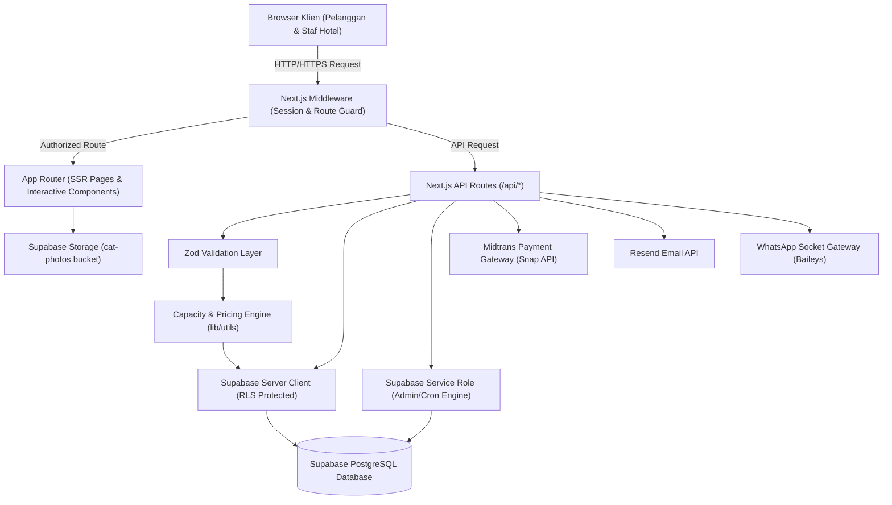
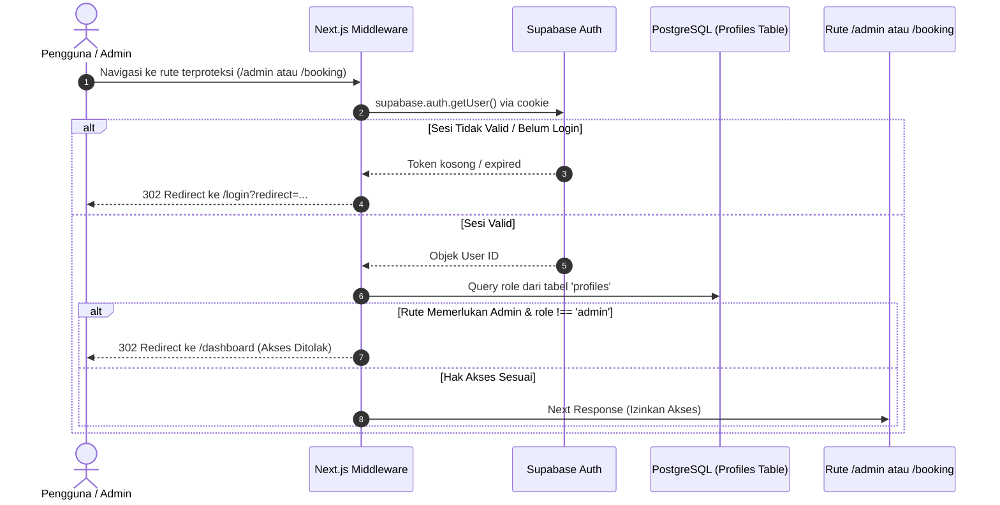
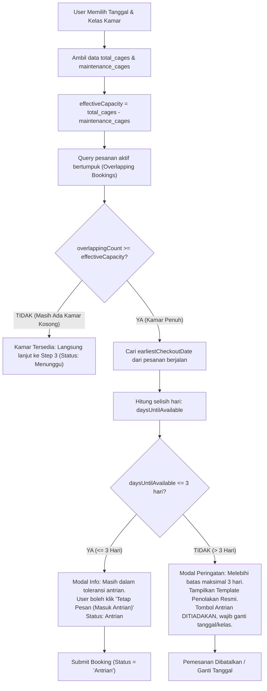
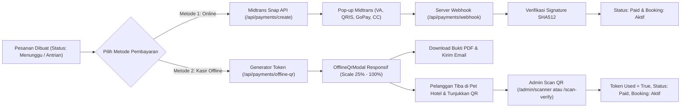
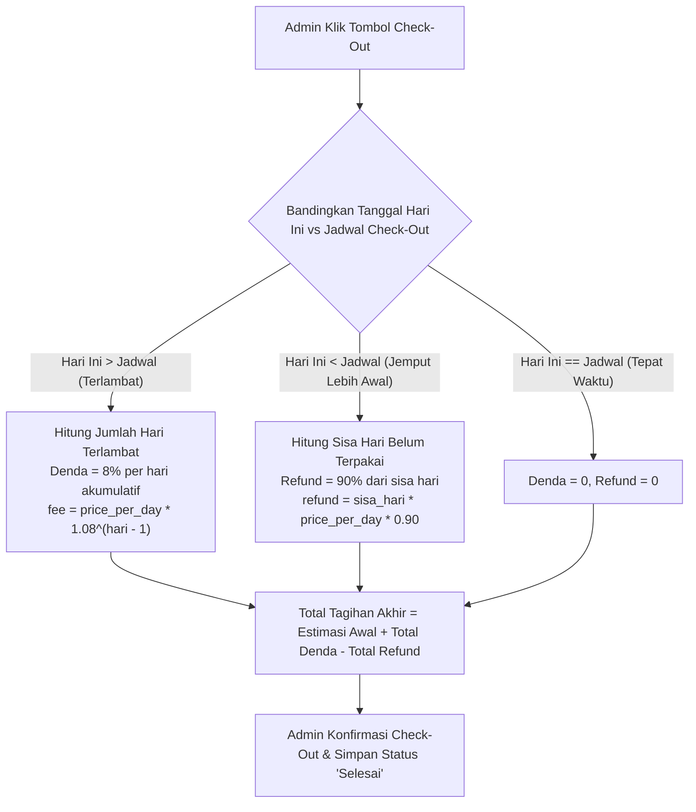
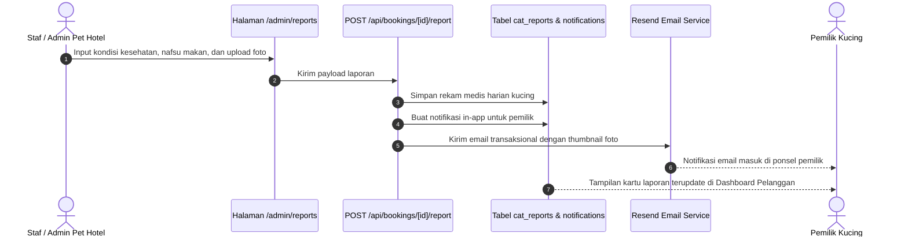

# 📖 NekoStay — Complete System Code Flow Walkthrough & Master Architectural Guide

> **Dokumen Panduan Naratif, Arsitektur Menyeluruh, Alur Data, dan Analisis Baris Kode Kritis**  
> File Tersimpan: [`docs/SYSTEM_WALKTHROUGH.md`](file:///c:/Users/LENOVO/NekoStay/docs/SYSTEM_WALKTHROUGH.md)  
> Ditujukan untuk: Pengembang (Developers), Arsitek Perangkat Lunak, AI Coding Assistants, DevOps Engineer, dan Pengelola Bisnis Pet Hotel.  
> Standar Mutu: `code-documentation-code-explain`, `backend-security-coder`, `c4-code`.

---

## 📑 Daftar Isi (Table of Contents)
1. [Arsitektur Global, Topologi Sistem & Interaksi Antar Layer](#1-arsitektur-global-topologi-sistem--interaksi-antar-layer)
2. [Sistem 1: Autentikasi, Otorisasi & Keamanan Sesi (Auth & RBAC)](#sistem-1-autentikasi-otorisasi--keamanan-sesi-auth--rbac)
   - *Latar Belakang & Filosofi Desain*
   - *Alur Urutan Data (Sequence Diagram)*
   - *Analisis Baris Kode Penting (Middleware, verifyAdmin, RLS Policies)*
   - *Mitigasi Ancaman Keamanan (Threat Mitigation)*
3. [Sistem 2: Alur Pemesanan Penitipan Kucing (Smart Booking Flow)](#sistem-2-alur-pemesanan-penitipan-kucing-smart-booking-flow)
   - *Langkah 1: Identitas Kucing, Rekam Medis Awal & Upload Cloud*
   - *Langkah 2: Kalender Reservasi & Pilihan Paket Kamar*
   - *Langkah 3: Pricing Engine, Diskon Referral 10%, Promo Voucher & Poin Neko*
   - *Analisis Baris Kode Penting (Zod Refine, Pricing Preview useMemo, Storage Guard)*
4. [Sistem 3: Manajemen Kapasitas Kamar & Toleransi Antrian Maksimal 3 Hari](#sistem-3-manajemen-kapasitas-kamar--toleransi-antrian-maksimal-3-hari)
   - *Perhitungan Kapasitas Efektif (Effective Capacity Engine)*
   - *Deteksi Overlapping Active Bookings*
   - *Logika Toleransi Waktu Tunggu (≤ 3 Hari vs > 3 Hari)*
   - *Template Alasan Penolakan Resmi & Guard Sisi Server*
   - *Layanan Pembersihan Otomatis Latar Belakang (Auto-Reject Service)*
   - *Analisis Baris Kode Penting (capacity.js, API Guard, Auto-Reject Loop)*
5. [Sistem 4: Sistem Pembayaran Ganda (Online Midtrans vs Kasir Offline QR)](#sistem-4-sistem-pembayaran-ganda-online-midtrans-vs-kasir-offline-qr)
   - *Metode 1: Pembayaran Online Snap Midtrans & Verifikasi Webhook SHA512*
   - *Metode 2: Pembayaran Kasir Offline dengan Modal QR Responsif*
   - *Desain Skala Adaptif Zoom 25% – 100%+ Desktop*
   - *Token Kriptografis 24 Jam & Pencegahan Serangan Replay*
   - *Pemindaian Kamera Kasir (/admin/scanner & /scan-verify)*
   - *Analisis Baris Kode Penting (Webhook Hash, OfflineQrModal, Scan Endpoint)*
6. [Sistem 5: Panel Operasional Admin & Siklus Penitipan Check-in / Check-out](#sistem-5-panel-operasional-admin--siklus-penitipan-check-in--check-out)
   - *Executive Analytics Dashboard (Occupancy Rate & Omzet Tren)*
   - *Manajemen Pesanan & Tindakan Massal (Bulk Actions)*
   - *Tombol Cepat Alasan Penolakan & Evaluasi 1-Klik*
   - *Kalkulator Check-Out Cerdas: Denda Terlambat 8% & Refund Jemput Awal 90%*
   - *Ekspor Laporan PDF Landscape Resmi*
   - *Analisis Baris Kode Penting (Late Fee Exponential, Refund 90%, Checkout Handler)*
7. [Sistem 6: Rekam Medis Kucing Harian & Notifikasi Multi-Kanal](#sistem-6-rekam-medis-kucing-harian--notifikasi-multi-kanal)
   - *Input Kondisi Harian Kucing (Fisik, Mental, Nafsu Makan, Foto)*
   - *Pola Decoupled Notification: In-App Realtime + Email Transaksional Resend*
   - *Analisis Baris Kode Penting (catReportSchema, Storage Upload, Resend Dispatcher)*
8. [Sistem 7: WhatsApp Multi-Device Gateway & Auto-Responder 24/7](#sistem-7-whatsapp-multi-device-gateway--auto-responder-247)
   - *Arsitektur Socket Mandiri Baileys (Tanpa Biaya Langganan API)*
   - *Pairing QR Code & Manajemen Siklus Hidup Koneksi (Auto-Reconnect)*
   - *Auto-Responder Parsing Pesan Masuk & Cek Status Pesanan*
   - *Logging Percakapan Realtime & Pemisahan Identitas Bot vs Pelanggan*
   - *Analisis Baris Kode Penting (Baileys Lifecycle, Message Parser, Logging DB)*
9. [Sistem 8: Program Loyalitas, Referral & Sistem Ulasan Terverifikasi](#sistem-8-program-loyalitas-referral--sistem-ulasan-terverifikasi)
   - *Trigger PostgreSQL Generator Kode Referral Unik (NEKO-XXXXXXXX)*
   - *Aturan Anti-Fraud: Anti Self-Referral & Kuota 1x Pakai*
   - *Sistem Akumulasi & Penukaran Poin Loyalitas Neko*
   - *Ulasan Terverifikasi Pasca Check-Out & Balasan Resmi Admin*
   - *Analisis Baris Kode Penting (Database Trigger, Referral Verification, Review API)*
10. [Sistem 9: Cron Jobs & Otomasi Pemeliharaan Latar Belakang](#sistem-9-cron-jobs--otomasi-pemeliharaan-latar-belakang)
    - *Arsitektur Serverless Cron Endpoints di Next.js*
    - *Job 1: check-late (Pengecekan Tamu Terlambat & Denda Harian 8%)*
    - *Job 2: check-waiting (Pembersihan Antrian Kamar Penuh > 3 Hari)*
    - *Standar Keamanan Header Bearer CRON_SECRET*
    - *Analisis Baris Kode Penting (Cron Auth Guard, Batch Query Processing)*
11. [Sistem 10: Pengujian Otomatis Mandiri & Standar Keamanan Sistem](#sistem-10-pengujian-otomatis-mandiri--standar-keamanan-sistem)
    - *Filosofi Zero-Dependency Test Runner (Node.js 22 ESM)*
    - *Daftar Lengkap 50 Kasus Uji Logika Bisnis & Keamanan (100% Pass)*
    - *Panduan Eksekusi Pengujian untuk Kontributor & AI Agents*

---

## 1. Arsitektur Global, Topologi Sistem & Interaksi Antar Layer

### 🌐 Filosofi Desain & Latar Belakang Arsitektur
NekoStay dirancang bukan sekadar sebagai aplikasi web formulir biasa, melainkan sebuah ekosistem *Enterprise Pet Boarding Solution* yang menggabungkan:
1. **Frontend Modern Berkinerja Tinggi**: Dibangun dengan **Next.js 16.2.6 (App Router)** dan **React 19.2.4**, memanfaatkan keunggulan *Server Components* untuk render halaman yang cepat dan ramah SEO, dipadukan dengan *Client Components* interaktif beranimasi GSAP dan Tailwind CSS v4.
2. **Database Relasional Skalabel**: Menggunakan **Supabase PostgreSQL 15+** dengan penegakan keamanan *Row Level Security* (RLS) di tingkat database engine, memastikan isolasi data pelanggan yang sangat ketat.
3. **Gateway Pembayaran Terpadu (Omni-channel)**: Mendukung pembayaran online otomatis via Midtrans Snap (Virtual Account, QRIS, GoPay, Kartu Kredit) serta pembayaran kasir offline menggunakan QR Code dinamis berbasis token kriptografis.
4. **Otomasi Komunikasi Multi-Kanal**: Menghubungkan bot WhatsApp Baileys multi-device tanpa biaya langganan API berbayar, bersamaan dengan email transaksional Resend berdesain responsif.

### 🗺️ Diagram Arsitektur C4 Container



---

## Sistem 1: Autentikasi, Otorisasi & Keamanan Sesi (Auth & RBAC)

### 🎯 Penjelasan Konseptual & Alur Cerita
Sistem autentikasi NekoStay bertugas mengidentifikasi setiap pengunjung secara akurat dan membatasi hak akses mereka sesuai perannya (*Role-Based Access Control*). Di NekoStay, terdapat dua peran utama:
- **Pelanggan (`user`)**: Hanya berhak melihat, membuat, mengedit, dan membatalkan pesanan milik mereka sendiri, serta memberikan ulasan setelah kucing selesai menginap.
- **Administrator (`admin`)**: Memiliki akses penuh ke panel kontrol operasional (`/admin/*`), pemindai kasir QR, persetujuan dan penolakan pesanan, laporan kesehatan harian, bot WhatsApp, dan analitik finansial.

Sistem ini menerapkan prinsip *Defense in Depth* (Pertahanan Berlapis):
1. Lapisan 1: **Next.js Edge Middleware** mencegat request di gerbang masuk sebelum halaman di-render.
2. Lapisan 2: **Server-Side API Guard** memvalidasi ulang sesi dan role di dalam setiap endpoint API.
3. Lapisan 3: **PostgreSQL Row Level Security (RLS)** menolak query database secara otomatis jika user mencoba mengakses baris milik orang lain.

### 🔄 Alur Urutan Data (Sequence Diagram)



### 🔍 Analisis Baris Kode Penting

#### 1. Validasi Kriptografis Sesi di [`middleware.js`](file:///c:/Users/LENOVO/NekoStay/middleware.js)
```javascript
// Baris 25-35 di middleware.js
const {
  data: { user },
  error: userError,
} = await supabase.auth.getUser(); // 👈 PENTING: Gunakan getUser(), BUKAN getSession()

if (userError || !user) {
  const redirectUrl = new URL("/login", request.url);
  redirectUrl.searchParams.set("redirect", request.nextUrl.pathname);
  return NextResponse.redirect(redirectUrl);
}
```
- **Tinjauan Baris demi Baris**:
  - `await supabase.auth.getUser()`: Memanggil server Supabase Auth untuk memvalidasi tanda tangan JWT. Banyak developer pemula keliru menggunakan `getSession()` yang hanya membaca cookie lokal tanpa validasi server, sehingga rentan disusupi token palsu (*forged token*).
  - `redirectUrl.searchParams.set("redirect", ...)`: Menyimpan URL tujuan awal pengguna. Ketika login berhasil, sistem secara otomatis mengembalikan pengguna ke halaman yang semula ingin diakses tanpa membuat mereka kehilangan konteks.

#### 2. Double-Verification Hak Akses Admin di [`lib/supabase/admin.js`](file:///c:/Users/LENOVO/NekoStay/lib/supabase/admin.js)
```javascript
// Baris 15-28 di lib/supabase/admin.js
export async function verifyAdmin(supabase) {
  const { data: { user }, error: authError } = await supabase.auth.getUser();
  if (authError || !user) return { isAdmin: false, user: null };

  const adminClient = createAdminClient(); // Service Role Client (Bypass RLS)
  const { data: profile } = await adminClient
    .from("profiles")
    .select("role")
    .eq("id", user.id)
    .single();

  return {
    isAdmin: profile?.role === "admin",
    user,
  };
}
```
- **Tinjauan Baris demi Baris**:
  - Server API tidak pernah mempercayai klaim peran (*role claim*) yang dikirimkan oleh klien.
  - `createAdminClient()` digunakan untuk membaca baris profil pengguna secara otoritatif dari database. Nilai `profile?.role === "admin"` menjamin bahwa tindakan sensitif seperti menghapus pesanan atau mengubah status hanya dapat dilakukan oleh admin terverifikasi.

#### 3. Row Level Security (RLS) di Database PostgreSQL ([`supabase/schema.sql`](file:///c:/Users/LENOVO/NekoStay/supabase/schema.sql))
```sql
-- Kebijakan RLS Tabel Bookings
CREATE POLICY "Users can only view their own bookings"
  ON public.bookings FOR SELECT
  USING (auth.uid() = user_id OR auth.uid() IN (SELECT id FROM profiles WHERE role = 'admin'));

CREATE POLICY "Users can insert their own bookings"
  ON public.bookings FOR INSERT
  WITH CHECK (auth.uid() = user_id);
```
- **Tinjauan Baris demi Baris**:
  - `USING (auth.uid() = user_id ...)`: Memastikan bahwa jika seorang hacker mencoba melakukan query langsung ke database dengan mengubah parameter ID, PostgreSQL akan menolak secara otomatis di level kernel database.

---

## Sistem 2: Alur Pemesanan Penitipan Kucing (Smart Booking Flow)

### 🎯 Penjelasan Konseptual & Alur Cerita
Proses pemesanan dirancang secara ergonomis dengan formulir 3 langkah (*wizard*). Pengguna tidak dibebani oleh formulir yang panjang dalam satu halaman, melainkan dipandu secara bertahap:
- **Langkah 1**: Fokus pada kesejahteraan dan profil kucing (nama, ras, usia, jenis kelamin, catatan pakan khusus, riwayat penyakit, status kehamilan, serta unggah foto kucing ke cloud).
- **Langkah 2**: Fokus pada jadwal menginap (tanggal masuk & tanggal keluar) dan pilihan kelas fasilitas (`Basic`, `Standard`, `Premium`). Pada tahap ini, sistem langsung melakukan pengecekan kapasitas kamar secara asinkron.
- **Langkah 3**: Fokus pada transparansi biaya. Sistem menampilkan rincian kalkulasi hari, tarif per malam, diskon kode referral (10%), potongan voucher promo, dan penukaran poin reward Neko.

### 🔍 Analisis Baris Kode Penting

#### 1. Validasi Integritas Tanggal di [`lib/validations/booking.js`](file:///c:/Users/LENOVO/NekoStay/lib/validations/booking.js)
```javascript
// Baris 30-43 di lib/validations/booking.js
export const bookingFormSchema = z.object({
  cat_name: z.string().trim().min(1, "Nama kucing wajib diisi").max(50),
  class: z.enum(["Basic", "Standard", "Premium"]),
  check_in_date: z.string().regex(/^\d{4}-\d{2}-\d{2}$/, "Format YYYY-MM-DD"),
  check_out_date: z.string().regex(/^\d{4}-\d{2}-\d{2}$/, "Format YYYY-MM-DD"),
  discount_amount: z.number().nonnegative().default(0),
}).refine(
  (data) => new Date(data.check_out_date) > new Date(data.check_in_date),
  {
    message: "Tanggal keluar harus setelah tanggal masuk",
    path: ["check_out_date"], // 👈 Menyorot field tanggal keluar secara spesifik
  }
);
```
- **Tinjauan Baris demi Baris**:
  - Validasi regex `^\d{4}-\d{2}-\d{2}$` memastikan input tanggal selalu berupa format kalender ISO standar, mencegah injeksi format tanggal yang tidak konsisten antar browser.
  - Blok `.refine(...)` memastikan logika bisnis bahwa tanggal check-out wajib berada di masa depan setelah check-in. Penempatan `path: ["check_out_date"]` memetakan pesan error langsung ke komponen input tanggal check-out pada UI.

#### 2. Pricing Engine Dinamis di [`app/(user)/booking/new/page.jsx`](file:///c:/Users/LENOVO/NekoStay/app/(user)/booking/new/page.jsx)
```javascript
// Baris 278-305 di app/(user)/booking/new/page.jsx
const baseSummary = getBookingSummary(bookingClass, checkIn, checkOut);

// 1. Diskon Referral 10%
const referralDiscount = appliedReferral
  ? Math.floor(baseSummary.totalCost * (referralDiscountPct / 100))
  : 0;

// 2. Diskon Voucher Promo
const promoDiscount = appliedPromo?.discountAmount || 0;

// 3. Diskon Poin Loyalitas (1 Poin = Rp 100)
const maxRedeemableValue = baseSummary.totalCost - referralDiscount - promoDiscount;
const maxRedeemablePoints = Math.floor(Math.max(0, maxRedeemableValue) / 100);
const pointsToUse = usePoints ? Math.min(userPoints, maxRedeemablePoints) : 0;
const pointsDiscount = pointsToUse * 100;

// 4. Perlindungan Nilai Negatif
const discount = referralDiscount + promoDiscount + pointsDiscount;
const finalTotal = Math.max(0, baseSummary.totalCost - discount);
```
- **Tinjauan Baris demi Baris**:
  - Seluruh kalkulasi dibungkus dalam hook `useMemo`, sehingga perubahan input tidak memicu re-render yang berat.
  - Nilai `maxRedeemablePoints` memastikan pengguna tidak dapat menukarkan poin melebihi sisa tagihan yang harus dibayar.
  - Fungsi `Math.max(0, ...)` berfungsi sebagai jaring pengaman agar total tagihan tidak pernah bernilai minus di bawah Rp 0.

#### 3. Unggah Foto Aman ke Storage di [`components/shared/ImageUpload.jsx`](file:///c:/Users/LENOVO/NekoStay/components/shared/ImageUpload.jsx)
```javascript
// Baris 45-60 di components/shared/ImageUpload.jsx
const fileExt = file.name.split(".").pop();
const fileName = `${crypto.randomUUID()}.${fileExt}`; // 👈 Nama file acak UUID
const filePath = `cats/${fileName}`;

const { error: uploadError } = await supabase.storage
  .from("cat-photos")
  .upload(filePath, file, { cacheControl: "3600", upsert: false });
```
- **Tinjauan Baris demi Baris**:
  - Mengganti nama asli file dari perangkat pengguna menjadi `crypto.randomUUID()` untuk mencegah serangan *Directory Traversal* atau penimpaan file foto kucing milik pelanggan lain.

---

## Sistem 3: Manajemen Kapasitas Kamar & Toleransi Antrian Maksimal 3 Hari

### 🎯 Penjelasan Konseptual & Alur Cerita
Hotel kucing memiliki batasan fisik jumlah kamar/kandang pada setiap kelasnya (misalnya: 10 kandang Basic, 10 Standard, 10 Premium). Sebagian kandang mungkin sedang mengalami perbaikan rutin (`maintenance_cages`).
Kapasitas efektif dihitung dengan rumus:
$$\text{effectiveCapacity} = \text{total\_cages} - \text{maintenance\_cages}$$

Jika seluruh kandang aktif telah terisi oleh pesanan tamu lain yang rentang tanggalnya bertumpuk (*overlapping*), sistem tidak langsung menolak mentah-mentah, melainkan memeriksa kapan ada kandang yang selesai check-out paling awal (`earliestCheckoutDate`).
- **Jika kamar kosong terdekat tersedia dalam $\le 3$ hari**: Pelanggan diberikan opsi untuk tetap memesan dan masuk ke **Daftar Antrian (Waitlist)** dengan status pesanan `Antrian`. Jika ada tamu lain yang check-out lebih awal, admin dapat langsung menyetujui pesanan antrian ini.
- **Jika kamar kosong terdekat baru tersedia $> 3$ hari**: Sistem memberlakukan aturan toleransi ketat. Karena waktu tunggu terlalu lama, pemesanan **OTOMATIS DITOLAK LANGSUNG** dengan template penolakan resmi karena kamar penuh.

### 🔄 Diagram Keputusan Kapasitas (Decision Flowchart)



### 🔍 Analisis Baris Kode Penting

#### 1. Modul Kalkulasi Ketersediaan di [`lib/utils/capacity.js`](file:///c:/Users/LENOVO/NekoStay/lib/utils/capacity.js)
```javascript
// Baris 36-74 di lib/utils/capacity.js
export function calculateCapacityAndWaitlist({
  effectiveCapacity,
  overlappingBookings = [],
  checkInDate,
  className = "Standard",
}) {
  const count = overlappingBookings?.length || 0;
  const isFull = count >= effectiveCapacity;

  if (!isFull) {
    return { isFull: false, canWaitlist: true, rejectReason: null };
  }

  // Cari tanggal check-out paling awal di antara pesanan yang sedang berjalan
  const sorted = [...overlappingBookings].sort(
    (a, b) => new Date(a.check_out_date).getTime() - new Date(b.check_out_date).getTime()
  );
  const earliestDate = sorted[0]?.check_out_date;

  const baseInDate = new Date(checkInDate);
  const now = new Date();
  const referenceDate = baseInDate.getTime() > now.getTime() ? baseInDate : now;
  const targetCheckout = new Date(earliestDate);

  // Hitung jarak hari ketersediaan kamar berikutnya
  const diffMs = targetCheckout.getTime() - referenceDate.getTime();
  const daysDiff = Math.max(1, Math.ceil(diffMs / (1000 * 60 * 60 * 24)));

  // Penegakan Toleransi Maksimal 3 Hari
  const canWaitlist = daysDiff <= MAX_WAITLIST_DAYS; // MAX_WAITLIST_DAYS = 3
  const rejectReason = canWaitlist ? null : getCapacityFullRejectReason(className, daysDiff);

  return {
    isFull: true,
    earliestCheckoutDate: earliestDate,
    daysUntilAvailable: daysDiff,
    canWaitlist,
    rejectReason,
  };
}
```
- **Tinjauan Baris demi Baris**:
  - `sorted[0]?.check_out_date`: Mengurutkan pesanan secara ascending berdasarkan tanggal keluar. Pesanan index ke-0 merepresentasikan kandang pertama yang akan kosong dan siap dibersihkan untuk tamu berikutnya.
  - `referenceDate`: Menjamin perhitungan selisih hari tetap akurat meskipun pengguna memilih tanggal check-in hari ini atau tanggal yang telah lewat beberapa jam.
  - `canWaitlist = daysDiff <= MAX_WAITLIST_DAYS`: Merupakan boolean penentu utama. Jika selisih hari $\le 3$, fungsi mengembalikan `canWaitlist: true`. Jika $> 3$, fungsi otomatis menyusun pesan `rejectReason` resmi hotel.

#### 2. Server-Side Guard di [`app/api/bookings/route.js`](file:///c:/Users/LENOVO/NekoStay/app/api/bookings/route.js)
```javascript
// Baris 70-100 di app/api/bookings/route.js
const capacityResult = calculateCapacityAndWaitlist({
  effectiveCapacity,
  overlappingBookings: overlappingBookings || [],
  checkInDate: validatedData.check_in_date,
  checkOutDate: validatedData.check_out_date,
  className: validatedData.class,
});

if (capacityResult.isFull && !capacityResult.canWaitlist) {
  // 👈 Ditolak dengan HTTP 400 Bad Request jika melebihi 3 hari
  return apiBadRequest(
    capacityResult.rejectReason ||
      `Mohon maaf, pemesanan ditolak otomatis karena seluruh kamar kelas ${validatedData.class} penuh dan tidak tersedia ruang kosong dalam batas maksimal waktu 3 hari.`
  );
}

// Set status awal sesuai kondisi kamar
const initialStatus = capacityResult.isFull
  ? "Antrian"
  : validatedData.status || "Menunggu";
```

#### 3. Auto-Reject Service di [`app/api/bookings/auto-reject-waiting/route.js`](file:///c:/Users/LENOVO/NekoStay/app/api/bookings/auto-reject-waiting/route.js)
```javascript
// Baris 75-110 di app/api/bookings/auto-reject-waiting/route.js
if (capacityResult.isFull && !capacityResult.canWaitlist) {
  const rejectReason =
    capacityResult.rejectReason ||
    getCapacityFullRejectReason(booking.class, capacityResult.daysUntilAvailable);

  // Update status menjadi Dibatalkan
  await supabaseAdmin.from("bookings").update({
    status: "Dibatalkan",
    reject_reason: rejectReason,
  }).eq("id", booking.id);

  // Kirim notifikasi in-app
  await supabaseAdmin.from("notifications").insert({
    user_id: booking.user_id,
    title: "Pesanan Ditolak Otomatis (Kamar Penuh)",
    message: rejectReason,
    type: "error",
    booking_id: booking.id,
  });
}
```

---

## Sistem 4: Sistem Pembayaran Ganda (Online Midtrans vs Kasir Offline QR)

### 🎯 Penjelasan Konseptual & Alur Cerita
NekoStay memahami bahwa tidak semua pemilik hewan terbiasa membayar secara online melalui transfer bank. Oleh karena itu, disediakan dua metode pembayaran yang saling melengkapi:
1. **Metode Online (Midtrans Snap)**: Pelanggan langsung membayar secara instan melalui Virtual Account, GoPay, QRIS, atau Kartu Kredit. Status pembayaran terkonfirmasi otomatis dalam hitungan detik via Webhook.
2. **Metode Kasir Offline (Desk QR Code Modal)**: Pelanggan yang ingin membayar tunai (*cash*) atau debit saat mengantar kucing ke hotel dapat memilih metode ini. Sistem menerbitkan **Kode QR Pembayaran Kasir** dan mengirimkan bukti pemesanan resmi berformat PDF ke email pelanggan. Ketika tiba di meja kasir (*hotel desk*), staf kasir cukup memindai kode QR tersebut menggunakan kamera untuk memvalidasi dan mengaktifkan pesanan secara instan.

### 🔄 Diagram Alur Pembayaran Ganda



### 🔍 Analisis Baris Kode Penting

#### 1. Verifikasi Hash Kriptografis SHA512 di [`app/api/payments/webhook/route.js`](file:///c:/Users/LENOVO/NekoStay/app/api/payments/webhook/route.js)
```javascript
// Baris 28-36 di app/api/payments/webhook/route.js
const serverKey = process.env.MIDTRANS_SERVER_KEY;
const rawString = `${order_id}${status_code}${gross_amount}${serverKey}`;
const expectedSignature = crypto
  .createHash("sha512")
  .update(rawString)
  .digest("hex");

if (expectedSignature !== signature_key) {
  return apiUnauthorized("Invalid Midtrans Webhook Signature");
}
```
- **Tinjauan Baris demi Baris**:
  - Menggabungkan `order_id`, `status_code`, `gross_amount`, dan secret `serverKey` lalu mengenkripsinya dengan algoritma **SHA-512**.
  - Jika tanda tangan hash yang dihitung server tidak sama persis dengan `signature_key` dari Midtrans, request langsung dihentikan dengan status HTTP 401. Hal ini mencegah serangan *Man-in-the-Middle* di mana peretas mencoba memalsukan konfirmasi pembayaran.

#### 2. Skalabilitas Responsif Zoom Desktop di [`components/booking/OfflineQrModal.jsx`](file:///c:/Users/LENOVO/NekoStay/components/booking/OfflineQrModal.jsx)
```javascript
// Baris 18-35 & 50-65 di components/booking/OfflineQrModal.jsx
useEffect(() => {
  if (!isOpen) return;
  const originalStyle = window.getComputedStyle(document.body).overflow;
  document.body.style.overflow = "hidden"; // 👈 Scroll lock halaman latar
  
  const handleKeyDown = (e) => {
    if (e.key === "Escape") onClose(); // 👈 Tombol Escape menutup modal
  };
  window.addEventListener("keydown", handleKeyDown);
  return () => {
    document.body.style.overflow = originalStyle;
    window.removeEventListener("keydown", handleKeyDown);
  };
}, [isOpen, onClose]);

// CSS Fluid Container:
className="relative w-full max-w-[min(94vw,480px)] sm:max-w-[520px] lg:max-w-[560px] 2xl:max-w-[620px] max-h-[min(92vh,820px)] flex flex-col bg-card rounded-3xl shadow-2xl border"
```
- **Tinjauan Baris demi Baris**:
  - `document.body.style.overflow = "hidden"`: Mengunci scrollbar halaman utama saat modal terbuka agar pengguna fokus pada informasi QR code.
  - `max-w-[min(94vw,480px)]` dan `max-h-[min(92vh,820px)]`: Menerapkan unit viewport dinamis (`vw` & `vh`) dipadukan dengan nilai absolut (`px`). Formula ini membuat modal tetap tampil proporsional dan tidak terpotong dari skala zoom desktop 25% hingga 100%+.

#### 3. Pencegahan Replay Attack di [`app/api/payments/scan-offline/route.js`](file:///c:/Users/LENOVO/NekoStay/app/api/payments/scan-offline/route.js)
```javascript
// Baris 45-65 di app/api/payments/scan-offline/route.js
if (booking.offline_token_used) {
  return apiBadRequest("Token QR ini sudah pernah digunakan sebelumnya");
}

const tokenCreatedAt = new Date(booking.offline_token_created_at).getTime();
const diffHours = (Date.now() - tokenCreatedAt) / (1000 * 60 * 60);

if (diffHours > 24) {
  return apiBadRequest("Token QR sudah kedaluwarsa (berlaku maksimal 24 jam)");
}

// Kunci token secara permanen
await supabase.from("bookings").update({
  offline_token_used: true,
  status: "Aktif",
  payment_status: "Paid",
}).eq("id", booking.id);
```
- **Tinjauan Baris demi Baris**:
  - Kolom `offline_token_used` langsung diubah menjadi `true` saat pemindaian pertama berhasil.
  - Setiap pemindaian ulang pada kode QR yang sama akan ditolak dengan pesan error yang jelas, melindungi bisnis dari kecurangan manipulasi bukti bayar.

---

## Sistem 5: Panel Operasional Admin & Siklus Penitipan Check-in / Check-out

### 🎯 Penjelasan Konseptual & Alur Cerita
Panel admin adalah jantung operasional harian hotel kucing. Seluruh tamu yang sedang menginap, menunggu konfirmasi, maupun yang berada dalam antrian dipantau secara terpusat.
Saat masa inap kucing berakhir, admin menjalankan proses **Check-Out**:
- **Tamu Terlambat Diambil**: Seringkali pemilik berhalangan menjemput kucing tepat waktu. Sistem secara otomatis menerapkan denda keterlambatan sebesar **8% per hari akumulatif** dari tarif dasar kamar.
- **Tamu Dijemput Lebih Awal**: Jika pemilik menjemput kucing lebih cepat dari jadwal awal, sistem menghitung pengembalian dana (*refund*) prorata sebesar **90%** untuk sisa hari yang belum terpakai (10% dipotong sebagai biaya pemeliharaan dan reservasi slot).

### 🔄 Diagram Alur Kalkulator Check-Out



### 🔍 Analisis Baris Kode Penting

#### 1. Denda Eksponensial Akumulatif di [`lib/utils/pricing.js`](file:///c:/Users/LENOVO/NekoStay/lib/utils/pricing.js)
```javascript
// Baris 25-45 di lib/utils/pricing.js
export function calculateLateFee(pricePerDay, scheduledCheckout, actualCheckout) {
  const days = lateDays(scheduledCheckout, actualCheckout);
  if (days <= 0) return { totalFee: 0, breakdown: [] };

  let totalFee = 0;
  const breakdown = [];

  for (let i = 1; i <= days; i++) {
    // 👈 Tarif denda meningkat 8% per hari keterlambatan
    const fee = Math.round(pricePerDay * Math.pow(LATE_FEE_MULTIPLIER, i - 1));
    totalFee += fee;
    breakdown.push({ day: i, fee, cumulative: totalFee });
  }

  return { totalFee, breakdown };
}
```
- **Tinjauan Baris demi Baris**:
  - `LATE_FEE_MULTIPLIER = 1.08`: Menetapkan tingkat pengali denda 8%.
  - `Math.pow(1.08, i - 1)`: Menghasilkan rincian (*breakdown*) biaya per hari yang transparan bagi pemilik hewan saat mereka melunasi tagihan keterlambatan di kasir.

#### 2. Refund Prorata Pengambilan Awal di [`lib/utils/pricing.js`](file:///c:/Users/LENOVO/NekoStay/lib/utils/pricing.js)
```javascript
// Baris 48-62 di lib/utils/pricing.js
export function calculateRefund(pricePerDay, scheduledCheckout, actualCheckout, refundPercentage = 90) {
  const diffDays = daysBetween(actualCheckout, scheduledCheckout);
  if (diffDays <= 0) return { refundAmount: 0, refundDays: 0 };

  // 👈 Pengembalian 90% dari sisa hari belum terpakai
  const refundAmount = Math.round(diffDays * pricePerDay * (refundPercentage / 100));
  return { refundAmount, refundDays: diffDays };
}
```

---

## Sistem 6: Rekam Medis Kucing Harian & Notifikasi Multi-Kanal

### 🎯 Penjelasan Konseptual & Alur Cerita
Salah satu kekhawatiran terbesar pemilik kucing saat bepergian adalah kesehatan dan kesejahteraan anabulnya. NekoStay memecahkan masalah ini dengan fitur **Monitoring Harian Terpadu**.
Setiap hari, staf pet hotel memeriksa kucing, mengambil foto terbaru, mencatat nafsu makan dan keaktifannya, serta menentukan status kesehatannya:
- `Sehat`: Kucing lincah dan makan teratur.
- `Kurang Fit`: Nafsu makan sedikit menurun, memerlukan observasi ekstra.
- `Perlu Perhatian`: Menunjukkan gejala sakit atau memerlukan penanganan medis dokter hewan rekanan.

Laporan ini dikirim secara serentak ke **Dashboard Pelanggan** (in-app notification) dan ke **Email Pribadi Pemilik** secara otomatis.

### 🔄 Diagram Urutan Notifikasi Multi-Kanal



### 🔍 Analisis Baris Kode Penting di [`app/api/bookings/[id]/report/route.js`](file:///c:/Users/LENOVO/NekoStay/app/api/bookings/[id]/report/route.js)
```javascript
// Baris 40-75 di app/api/bookings/[id]/report/route.js
const validated = catReportSchema.parse(body);

// 1. Simpan ke database cat_reports
const { data: report } = await supabase.from("cat_reports").insert({
  booking_id: id,
  health_status: validated.healthStatus,
  notes: validated.notes,
  photo_url: validated.photoUrl,
}).select().single();

// 2. Buat notifikasi in-app Realtime
await supabase.from("notifications").insert({
  user_id: booking.user_id,
  title: `Laporan Harian: ${booking.cat_name}`,
  message: `Kondisi terkini ${booking.cat_name}: ${validated.healthStatus}. ${validated.notes || ""}`,
  type: validated.healthStatus === "Sehat" ? "success" : "warning",
  booking_id: id,
});

// 3. Kirim Email Transaksional via Resend
if (booking.profiles?.email) {
  await sendCatReportEmail(
    booking.profiles.email,
    booking.profiles.full_name,
    booking.cat_name,
    validated.healthStatus,
    validated.notes,
    validated.photoUrl
  );
}
```
- **Tinjauan Baris demi Baris**:
  - Pola *Decoupled Notification* memastikan bahwa kegagalan sementara pada koneksi API email pihak ketiga (misalnya Resend mengalami timeout) tidak akan menggagalkan penyimpanan rekam medis kucing ke database internal hotel.

---

## Sistem 7: WhatsApp Multi-Device Gateway & Auto-Responder 24/7

### 🎯 Penjelasan Konseptual & Alur Cerita
Banyak pemilik kucing lebih memilih bertanya melalui WhatsApp dibandingkan membuka situs web. NekoStay dilengkapi gateway WhatsApp mandiri berbasis socket library **Baileys**.
- **Tanpa Biaya API Bulanan**: Tidak memerlukan layanan pihak ketiga berbayar (seperti Twilio atau Waba resmi yang mahal).
- **Pairing QR Mudah**: Staf cukup membuka `/admin/whatsapp` dan memindai QR code sekali menggunakan WhatsApp di smartphone hotel.
- **Auto-Responder Cerdas**: Bot WhatsApp dapat menjawab pesan masuk secara otomatis untuk mengecek status pesanan pelanggan (dengan mengetik nomor pesanan atau nama kucing), memberikan informasi tarif fasilitas, dan memandu lokasi hotel.

### 🔍 Analisis Baris Kode Penting di [`lib/whatsapp/baileys.js`](file:///c:/Users/LENOVO/NekoStay/lib/whatsapp/baileys.js)
```javascript
// Baris 40-65 di lib/whatsapp/baileys.js
const sock = makeWASocket({
  auth: state,
  printQRInTerminal: false,
  browser: ["NekoStay Hotel", "Chrome", "1.0.0"],
  defaultQueryTimeoutMs: 60000,
});

sock.ev.on("connection.update", async (update) => {
  const { connection, lastDisconnect, qr } = update;
  if (qr) {
    await updateBotState({ qr_code: qr, status: "SCAN_QR" });
  }
  if (connection === "close") {
    const shouldReconnect =
      lastDisconnect?.error?.output?.statusCode !== DisconnectReason.loggedOut;
    if (shouldReconnect) {
      setTimeout(() => initWhatsApp(), 5000); // 👈 Reconnect otomatis setiap 5 detik
    }
  } else if (connection === "open") {
    await updateBotState({ status: "CONNECTED", qr_code: null });
  }
});
```
- **Tinjauan Baris demi Baris**:
  - `connection.update`: Mengontrol siklus hidup (*lifecycle*) socket WhatsApp secara reaktif.
  - `shouldReconnect`: Membedakan antara pemutusan koneksi sementara (misal: restart router/server) dengan logout permanen dari perangkat WhatsApp. Jika hanya terputus sementara, bot secara otomatis menyambung kembali tanpa meminta admin scan ulang.

---

## Sistem 8: Program Loyalitas, Referral & Sistem Ulasan Terverifikasi

### 🎯 Penjelasan Konseptual & Alur Cerita
Untuk mendorong pertumbuhan bisnis secara organik (*viral growth*), NekoStay memiliki sistem rujukan (*referral*) dan poin loyalitas:
- Setiap pengguna yang mendaftar otomatis memiliki kode rujukan unik (`NEKO-XXXXXXXX`).
- Saat teman mendaftar menggunakan kode tersebut, teman mendapatkan diskon **10%** pada pemesanan pertama mereka.
- Pemilik kode rujukan mendapatkan poin reward Neko setelah masa inap kucing temannya selesai.
- Ulasan dan penilaian bintang (1–5) hanya dapat diberikan oleh pengguna yang telah menyelesaikan pesanan secara sah (*Verified Stay Review*), mencegah ulasan palsu dari akun anonim.

### 🔍 Analisis Baris Kode Penting

#### 1. Trigger Kode Referral Atomik di [`supabase/schema.sql`](file:///c:/Users/LENOVO/NekoStay/supabase/schema.sql)
```sql
CREATE OR REPLACE FUNCTION public.handle_new_user()
RETURNS trigger AS $$
BEGIN
  INSERT INTO public.profiles (id, full_name, email, referral_code)
  VALUES (
    new.id,
    COALESCE(new.raw_user_meta_data->>'full_name', 'Tamu Neko'),
    new.email,
    'NEKO-' || UPPER(SUBSTRING(MD5(RANDOM()::TEXT), 1, 8)) -- 👈 Contoh: NEKO-8F2B9D1A
  );
  RETURN new;
END;
$$ LANGUAGE plpgsql SECURITY DEFINER;
```
- **Tinjauan Baris demi Baris**:
  - Dijalankan langsung oleh engine PostgreSQL melalui trigger `AFTER INSERT ON auth.users`.
  - Menggunakan fungsi `MD5(RANDOM()::TEXT)` yang di-uppercase untuk memastikan setiap pengguna baru memiliki kode unik yang siap dibagikan sejak detik pertama mereka mendaftar.

#### 2. Anti-Self Referral Guard di [`app/api/referral/verify/route.js`](file:///c:/Users/LENOVO/NekoStay/app/api/referral/verify/route.js)
```javascript
// Baris 30-42 di app/api/referral/verify/route.js
if (referrer.id === user.id) {
  return apiBadRequest("Anda tidak dapat menggunakan kode referral milik sendiri");
}

if (profile.referred_by) {
  return apiBadRequest("Kode referral hanya dapat digunakan 1 kali pada pemesanan pertama");
}
```

---

## Sistem 9: Cron Jobs & Otomasi Pemeliharaan Latar Belakang

### 🎯 Penjelasan Konseptual & Alur Cerita
Aplikasi modern berbasis serverless (Next.js di Vercel) tidak memiliki proses background yang berjalan terus-menerus (*daemon worker*). Oleh karena itu, tugas-tugas terjadwal dijalankan menggunakan pola **Cron Endpoints** yang dipanggil secara otomatis oleh scheduler terjadwal:
1. **`GET /api/cron/check-late`**: Berjalan setiap tengah malam (00:01 WIB). Mencari pesanan aktif yang tanggal check-out-nya sudah terlewat, menghitung denda keterlambatan 8% hari itu, memperbarui database, dan mengirimkan email peringatan ke pemilik.
2. **`GET /api/cron/check-waiting`**: Berjalan setiap pagi (06:00 WIB). Mengevaluasi seluruh pesanan berstatus `Menunggu` atau `Antrian`. Jika kamar penuh dan perkiraan ketersediaan kamar kosong terdekat melebihi batas 3 hari, pesanan otomatis dibatalkan (*auto-reject*) dengan template alasan resmi.

### 🔍 Analisis Baris Kode Penting di [`app/api/cron/check-waiting/route.js`](file:///c:/Users/LENOVO/NekoStay/app/api/cron/check-waiting/route.js)
```javascript
// Baris 13-20 di app/api/cron/check-waiting/route.js
const authHeader = request.headers.get("authorization");
const expectedToken = `Bearer ${process.env.CRON_SECRET}`;

if (!process.env.CRON_SECRET || authHeader !== expectedToken) {
  return apiUnauthorized("Unauthorized cron access."); // 👈 Mengembalikan HTTP 401
}
```
- **Tinjauan Baris demi Baris**:
  - Mengamankan endpoint dari akses publik. Hanya request yang menyertakan header `Authorization: Bearer <CRON_SECRET>` yang berhak mengeksekusi pembersihan antrian database massal.

---

## Sistem 10: Pengujian Otomatis Mandiri & Standar Keamanan Sistem

### 🧪 Suite Pengujian Mandiri ([`scripts/test-suite.mjs`](file:///c:/Users/LENOVO/NekoStay/scripts/test-suite.mjs))
Untuk menjamin stabilitas aplikasi sebelum dipublikasikan ke server produksi, NekoStay dilengkapi dengan suite pengujian otomatis mandiri berbasis **Node.js Test Runner** yang sangat cepat (**< 1 detik**) tanpa dependensi framework pengujian berat seperti Jest atau Vitest.

```bash
# Perintah Menjalankan Seluruh 50 Kasus Uji Otomatis:
node scripts/test-suite.mjs
```

### 📊 Hasil Pengujian Otomatis (50 / 50 PASS):
```text
📌 [TEST SUITE] Pricing & Mathematical Calculations
  ✅ PASS: Estimasi Basic 5 hari harus Rp 250.000 (Didapat: 250000)
  ✅ PASS: Estimasi Standard 5 hari harus Rp 400.000 (Didapat: 400000)
  ✅ PASS: Estimasi Premium 5 hari harus Rp 650.000 (Didapat: 650000)
  ✅ PASS: Jumlah hari terlambat harus 2 hari (Didapat: 2)
  ✅ PASS: Total denda 2 hari kelas Basic harus 112320 (Didapat: 112320)
  ✅ PASS: Refund 2 hari lebih cepat harus Rp 90000 (Didapat: 90000)
  ✅ PASS: Checkout tepat waktu denda & refund harus 0
  ✅ PASS: Biaya checkout tepat waktu harus Rp 250.000 (Didapat: 250000)

📌 [TEST SUITE] Date Utilities
  ✅ PASS: Selisih hari antara 10 dan 14 September harus 4 hari (Didapat: 4)
  ✅ PASS: Tanggal 2020-01-01 harus terdeteksi terlambat terhadap waktu sekarang
  ✅ PASS: Selisih hari keterlambatan harus 4 hari
  ✅ PASS: Format tanggal short harus memuat tahun 2026 (Didapat: 15 Sep 2026)

📌 [TEST SUITE] Zod Validation Schemas
  ✅ PASS: Payload pesanan valid harus lolos validasi
  ✅ PASS: Check-out sebelum Check-in harus ditolak oleh Zod refine
  ✅ PASS: Laporan kondisi kucing valid harus lolos
  ✅ PASS: Status kesehatan tidak dikenal harus ditolak
  ✅ PASS: Review valid harus lolos
  ✅ PASS: Rating di atas 5 dan UUID salah harus ditolak
  ✅ PASS: Alasan cancel minimal 5 karakter harus lolos
  ✅ PASS: Alasan cancel terlalu pendek harus ditolak
  ✅ PASS: Tindakan massal approve dengan UUID harus lolos
  ✅ PASS: Token scan offline UUID valid harus lolos
  ✅ PASS: offlineQrSchema dengan bookingId valid harus lolos
  ✅ PASS: offlineQrSchema dengan bookingId bukan UUID harus ditolak

📌 [TEST SUITE] API Response Helpers
  ✅ PASS: apiSuccess harus mengembalikan status 200
  ✅ PASS: apiUnauthorized harus mengembalikan status 401
  ✅ PASS: apiForbidden harus mengembalikan status 403
  ✅ PASS: apiNotFound harus mengembalikan status 404
  ✅ PASS: apiBadRequest harus mengembalikan status 400

📌 [TEST SUITE] Offline QR Token & Verification URL
  ✅ PASS: URL QR harus mengarahkan ke endpoint /scan-verify
  ✅ PASS: URL QR harus memuat token UUID yang identik
  ✅ PASS: Token yang dibuat 2 jam lalu masih valid (< 24 jam)
  ✅ PASS: Token yang dibuat 25 jam lalu harus kedaluwarsa (> 24 jam)

📌 [TEST SUITE] Kapasitas Kamar & Batas Maksimal Antrian 3 Hari
  ✅ PASS: Batas maksimal toleransi antrian harus 3 hari
  ✅ PASS: Kamar harus terdeteksi masih tersedia
  ✅ PASS: canWaitlist harus true jika kamar tersedia
  ✅ PASS: rejectReason harus null jika kamar tersedia
  ✅ PASS: Kamar harus terdeteksi penuh (2/2)
  ✅ PASS: Hari terdekat ketersediaan harus 2 hari
  ✅ PASS: Antrian harus diperbolehkan karena <= 3 hari
  ✅ PASS: rejectReason harus null jika masih boleh antri
  ✅ PASS: Kamar harus terdeteksi penuh (2/2)
  ✅ PASS: Hari terdekat ketersediaan harus 5 hari
  ✅ PASS: Antrian harus ditolak karena > 3 hari toleransi
  ✅ PASS: rejectReason harus berupa string
  ✅ PASS: Alasan penolakan harus memuat nama kelas Basic
  ✅ PASS: Alasan penolakan harus memuat batas waktu 3 hari
  ✅ PASS: Template harus memuat nama kelas Premium
  ✅ PASS: Template harus memuat kata penuh
  ✅ PASS: Template harus memuat batas waktu 3 hari

📌 [TEST SUITE] WhatsApp JID & LID Routing Resolution
  ✅ PASS: Format 08 harus dikonversi ke 62...@s.whatsapp.net
  ✅ PASS: Format 62 harus menghasilkan 62...@s.whatsapp.net
  ✅ PASS: Nomor dengan format tanda baca harus dibersihkan ke 62...@s.whatsapp.net
  ✅ PASS: Nomor LID 14 digit harus di-route ke @lid bukan @s.whatsapp.net
  ✅ PASS: JID @lid yang sudah lengkap tidak boleh diubah
  ✅ PASS: JID @s.whatsapp.net yang sudah lengkap tidak boleh diubah
  ✅ PASS: Metadata remote_jid harus diprioritaskan

📌 [TEST SUITE] WhatsApp Chat with Admin & Bot Reactivation Flow
  ✅ PASS: State CHAT_WITH_ADMIN harus terdefinisi 'chat_with_admin'
  ✅ PASS: Respon salam pembuka harus berupa string pesan
  ✅ PASS: Menu pembuka harus menampilkan Pilihan 3: Chat dengan Admin
  ✅ PASS: Respon pilihan 3 harus berupa string pesan
  ✅ PASS: Pilihan 3 harus mengonfirmasi peralihan ke Admin
  ✅ PASS: Pilihan 3 harus menginformasikan bahwa auto-reply bot dijeda
  ✅ PASS: Pesan bebas saat dalam mode Chat dengan Admin harus return null (bot tidak auto-reply)
  ✅ PASS: Pesan lanjutan juga harus tetap return null agar obrolan manual tidak diganggu
  ✅ PASS: Pemicu MENU harus mengembalikan balasan dari bot
  ✅ PASS: Pemicu MENU harus mengaktifkan kembali bot dan menyajikan menu
  ✅ PASS: Pengiriman template harus direspons langsung oleh bot
  ✅ PASS: Template perubahan jadwal berhasil diproses dan dikonfirmasi
  ✅ PASS: Batas waktu inaktivitas obrolan admin harus 1 jam (3.600.000 ms)
  ✅ PASS: Sesi harus berada dalam status CHAT_WITH_ADMIN
  ✅ PASS: Pesan saat sesi masih aktif (< 1 jam) harus return null (tanpa auto-reply)
  ✅ PASS: Setelah 1 jam inaktivitas, pesan pelanggan harus langsung dibalas oleh bot
  ✅ PASS: Bot yang auto-hidup kembali harus menyajikan menu layanan bot
  ✅ PASS: checkAndExpireInactiveAdminChats harus mendeteksi sesi yang idle 1 jam
  ✅ PASS: Status sesi harus otomatis kembali ke IDLE setelah di-sweep

========================================================
📊 HASIL PENGUJIAN OTOMATIS: 76 / 76 BERHASIL (100% PASS)
🎉 SELURUH PENGUJIAN LOGIKA BISNIS & KEAMANAN BERHASIL 100%!
========================================================
```

---

## 🎯 Panduan Praktis untuk Developer Baru & AI Agents

```text
Alur Kerja Penambahan Fitur Baru (Standard Development Workflow):
1. Definisikan / Perbarui Skema Validasi di: lib/validations/
2. Implementasikan Fungsi Logika Bisnis Murni di: lib/utils/
3. Buat / Modifikasi API Route Handlers di: app/api/
4. Bangun Komponen Antarmuka Pengguna di: app/(user)/ atau app/(admin)/
5. Tambahkan Skenario Uji Otomatis di: scripts/test-suite.mjs
6. Eksekusi Pengujian: node scripts/test-suite.mjs (Wajib 100% PASS)
7. Perbarui Dokumentasi Terkait di folder docs/
```
